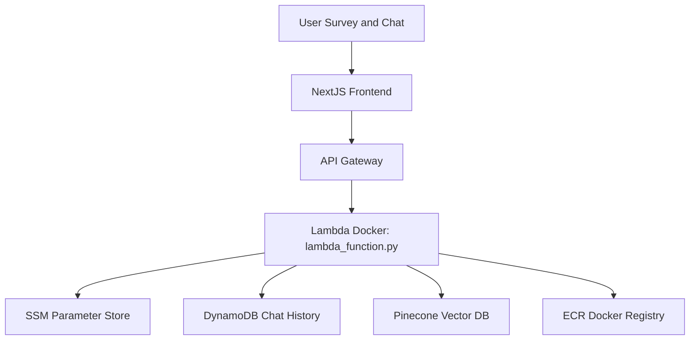

# Product Requirements Document (PRD) - Matchya

## 1. Overview

Matchya is an AI-driven platform that connects therapy-seekers with therapists using natural language conversations and structured questionnaire inputs. This document outlines the system design, application requirements, infrastructure details, and key data structures.

## 2. System Design



- **Architecture Components:**

  - **Frontend:** Developed in NextJS. NextJS routes make API calls to backend endpoints.
  - **API Gateway:** Routes external http requests (GET, POST, PUT) to the backend Lambda functions.
  - **Backend Lambda:** A Docker container hosted on AWS Lambda running `lambda_function.py` processes requests (profile lookups, updates, chat handling, etc.).
  - **Vector Search:** Uses Pinecone to perform similarity searches based on therapist profiles.

- **Data Flow:**
  1. The user interacts with the frontend (using NextJS) and completes a 6-question survey as defined in [questionnaire.md](./questionnaire.md).
  2. Structured responses are merged with any freeform inputs to craft search filters.
  3. NextJS routes call AWS API Gateway endpoints, which forward the requests to the Lambda function (from `lambda_function.py`).
  4. The Lambda processes inputs, queries therapist profiles stored in Pinecone (following the schema defined in [pinecone_profile.json](./pinecone_profile.json)), and performs operations like profile scraping, matching, and updates.
  5. Responses are sent back to the NextJS frontend for display and further interactions.

## 3. Application Requirements

- **Functional Requirements:**

  - Respond to health check requests and therapist profile queries.
  - Update therapist profiles and metadata (e.g., subscription details).
  - Perform therapist similarity search using structured filters from the questionnaire.
  - Support conversational chat for follow-up queries (e.g., natural language, insurance info).

- **Non-Functional Requirements:**
  - High availability and low latency responses.
  - Secure handling of user and therapist data.
  - Scalability on AWS using API Gateway + Lambda.
  - Ease of deployment via Docker containers and ECR.

## 4. Current Infrastructure

- **AWS Components:**

  - **API Gateway:** Defines endpoints (GET `/profile`, POST `/profile/update`, GET `/profile/scrape`, POST `/chat`, etc.) routing to the Lambda.
  - **Lambda (Docker-based):** Runs `lambda_function.py` from a Docker image stored in ECR.
  - **SSM Parameter Store:** Holds configuration keys (e.g., `OPENAI_API_KEY`, `PINECONE_API_KEY`, `PINECONE_INDEX`).
  - **Pinecone:** Provides vector database for storing and querying therapist embedding vectors.
  - **DynamoDB:** Stores chat history and session messages.

- **Deployment Workflow:**
  1. Build and push the Docker image (using the provided Dockerfile).
  2. Update the Lambda function to use the new image.
  3. Monitor logs in CloudWatch for verification of deployments.

## 5. Data Structures

- **Therapist Profile ([pinecone_profile.json](./pinecone_profile.json)):**

  - Contains fields such as `name`, `bio`, `languages`, `specialties`, `approaches`, and contact links.
  - Used for generating therapist embeddings and matching against user preferences.

- **Questionnaire ([questionnaire.md](./questionnaire.md)):**

  - Defines structured keys like `reason`, `frequency`, `session_type`, etc.
  - Provides mapping guidelines to convert freeform and structured responses into query filters (using operators like `$in`, `$eq`).

- **Blog & Marketing Material ([blog/MATCHYA_101.md](./blog/MATCHYA_101.md)):**
  - Contains product messaging, feature descriptions, and user benefits.
  - Helps align marketing content with product functionalities.

## 6. Workflow & Data Pipeline

1. **User Interaction:**
   Users complete a survey and chat via the NextJS frontend.
2. **API Call:**
   Requests are sent from NextJS routes to API Gateway.
3. **Backend Processing:**
   Lambda processes the request, handles data mapping (using `preference_mapper.py`), and communicates with Pinecone for vector queries.
4. **Response Delivery:**
   Processed data (therapist matches, chat responses, etc.) is returned back through API Gateway to the frontend.

## 7. Implementation Considerations

- **Frontend Integration:**
  NextJS routes must properly trigger the API endpoints, ensuring CORS headers and proper error handling.
- **Scalability & Performance:**
  Leverage AWS Lambda’s auto-scaling and API Gateway throttling for peak loads.
- **Data Privacy:**
  Ensure sensitive data (e.g., user chat history, therapist profiles) is managed securely and in compliance with applicable regulations.
- **Monitoring & Logging:**
  Usage of CloudWatch for Lambda monitoring and error logging is essential.
- **Future Enhancements:**
  - Expand to include other healthcare providers (e.g., physiotherapists, dietitians).
  - Incorporate more advanced ML/AI for deeper personalization.
  - Additional integration with scheduling or booking systems.

## 8. Conclusion

Matchya strives to simplify the therapist matching process through a combination of structured questionnaire data and natural language conversations. By using modern AWS services and a robust Dockerized Lambda backend, the platform is built to be secure, scalable, and accurate in meeting both therapist and client needs.

```

```
