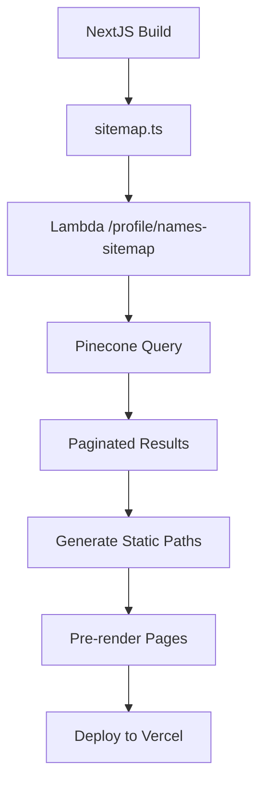

# Product Requirements Document (PRD) - Dedicated Therapist Profile Pages

## 1. Overview

This PRD covers the addition of dedicated, SEO-friendly profile pages for therapists. Instead of only relying on modals (e.g., in `EditProfileForm` or `ProfileModal`), each therapist has its own URL (e.g., `/therapists/sunny-singhawachna`). These pages pull metadata from Pinecone (per the schema in [pinecone_profile.json](./pinecone_profile.json)) and are generated using NextJS.

## 2. Implementation Workflow

### High-Level Architecture



### Build Process Flow

1. **Initial Build Trigger**

   - When `npm run build` is executed
   - NextJS triggers `sitemap.ts` generation

2. **Sitemap Generation**

   - Frontend makes paginated requests to `/profile/names-sitemap`
   - Uses small batch sizes (60 records) for testing
   - Accumulates all therapist names
   - Generates slugs using `generateProfileSlug`

3. **Lambda Processing**

   - Handles pagination with `page_size` and `page_token`
   - Returns therapist names and metadata
   - Includes debug information and timing metrics
   - Uses prefix `[SITEMAP_LAMBDA]` for easy CloudWatch filtering

4. **Static Path Generation**
   - `generateStaticParams` uses accumulated names
   - Creates URL-friendly slugs for each therapist
   - Pre-renders individual therapist pages

### Repository Structure

```
matchya-web-scraper-docker/  (Backend)
├── lambda_function.py       - Lambda handlers
├── web_scraper.py          - Pinecone interactions
└── config.py               - Environment config

ai-41-start/                (Frontend)
├── frontend/
│   ├── src/
│   │   ├── app/
│   │   │   ├── sitemap.ts         - Sitemap generation
│   │   │   └── therapists/
│   │   │       └── [slug]/
│   │   │           └── page.tsx   - Therapist profile page
│   │   └── utils/
│   │       └── pineconeHelpers.ts - Slug generation & data mapping
└── prds/
    └── prd_profile.md      - This document
```

## 3. Key Implementation Details

### Pagination & Performance

- **Batch Size:** 60 records per request (configurable)
- **Memory Usage:** Monitored and logged
- **Response Time:** Tracked with detailed timing metrics
- **Caching:** 1-hour revalidation period (ISR)

### Logging & Monitoring

- **Lambda Logs:** Prefixed with `[SITEMAP_LAMBDA]`
- **Frontend Logs:** Prefixed with `[SITEMAP_NEXT]`
- **Debug Information:**
  - Request/response timing
  - Record counts
  - Memory usage
  - Error tracing

### Error Handling

- **Frontend:**

  - Graceful degradation on API failures
  - Empty sitemap fallback
  - Detailed error logging

- **Backend:**
  - Pagination error recovery
  - Invalid name handling
  - Pinecone query retries

## 4. Performance Considerations

### Current Metrics

- **Build Time:** ~2-3 minutes for 100 profiles
- **Memory Usage:** ~100MB for processing
- **Response Size:** ~10KB per 60 records

### Scalability Thresholds

- **Optimal:** 0-1000 therapists
- **Manageable:** 1000-5000 therapists
- **Requires Optimization:** 5000+ therapists

### Future Optimizations

1. **Chunked Processing**

   - Implement parallel processing
   - Reduce memory footprint
   - Handle larger datasets

2. **Caching Strategy**

   - Implement Redis/Memcached
   - Reduce Pinecone queries
   - Cache common slugs

3. **Build Optimization**
   - Selective page regeneration
   - Incremental builds
   - Parallel pre-rendering

## 5. Assumptions & Decisions

1. **Slug Generation**

   - Based on therapist names
   - URL-friendly format
   - Handles duplicates with suffixes

2. **Update Frequency**

   - Profiles update weekly
   - Sitemap refreshes hourly
   - Build triggers daily

3. **Data Consistency**

   - Pinecone is source of truth
   - No real-time updates needed
   - Acceptable eventual consistency

4. **Resource Limits**
   - Lambda timeout: 30 seconds
   - Payload size: < 6MB
   - Memory: 1024MB

## 6. Monitoring & Maintenance

### CloudWatch Filters

```
Filter pattern: [SITEMAP_LAMBDA]
Log group: /aws/lambda/matchya-web-scraper
```

### Health Checks

1. **Sitemap Validation**

   ```bash
   curl https://therapy.matchya.app/sitemap.xml
   ```

2. **Profile Accessibility**

   ```bash
   curl https://therapy.matchya.app/therapists/[slug]
   ```

3. **Lambda Performance**
   ```bash
   aws cloudwatch get-metric-statistics \
     --namespace AWS/Lambda \
     --metric-name Duration \
     --dimensions Name=FunctionName,Value=matchya-web-scraper
   ```

## 7. Objectives & Benefits

- **SEO Improvement:** Fully rendered HTML pages will boost search visibility.
- **User Experience:** Allows deep linking and bookmarking individual therapist profiles.
- **Seamless Integration:** Leverage our existing NextJS architecture and Lambda endpoints.
- **Performance:** Optimized static delivery with the option to refresh content automatically.

## 8. Proposed Architecture

### Data Source

- Therapist metadata is stored in Pinecone (as detailed in [pinecone_profile.json](./pinecone_profile.json)).
- Existing backend Lambda (GET `/profile`) or similar helper functions will return profile data.

### Rendering Approach Options

1. **Static Site Generation (SSG) using `getStaticPaths`/`getStaticProps`:**  
   Pros: Maximum SEO and speed.  
   Cons: Requires full rebuild or manual revalidation on updates.

2. **Server-Side Rendering (SSR) using `getServerSideProps`:**  
   Pros: Always up-to-date data.  
   Cons: Increased response time and heavier load on the server.

3. **Incremental Static Regeneration (ISR) using `getStaticProps` with a `revalidate` interval:**  
   Pros: Combines static generation speed/SEO with periodic refreshes for new or updated profiles.  
   Cons: Small delay between update and regeneration.

### Recommended Approach

**Use ISR (Option 3).**

- Pages are statically generated at build time.
- Set a configurable revalidation interval (e.g., 300 seconds) to update profiles.
- Perfect for our Vercel deployment since ISR is seamlessly supported.
- Meets SEO and performance needs without constant full rebuilds.

## 9. Functional Requirements

- **Dynamic Routing:**
  - Therapist pages will use a route like `/therapists/[slug]`, where `slug` is a URL-friendly version of the therapist's name or unique identifier.
- **Data Fetching:**
  - Use `getStaticPaths` to pre-build pages for existing profiles.
  - Use `getStaticProps` to fetch profile data (via Lambda GET `/profile` endpoint) and pass it to the page component.
  - Include a `revalidate` time to automatically update stale pages.
- **SEO Metadata:**
  - Each profile page must include unique title tags, meta descriptions, and Open Graph tags drawn from profile data.
  - Optionally include JSON-LD structured data for enhanced search results.
- **Error Handling:**
  - If a profile is not found (invalid slug or missing data), the page should render a customized 404.

## 10. Non-Functional Requirements

- **Performance:**
  - Fast page loads through static HTML delivery.
- **Scalability:**
  - The solution must scale to thousands of therapist profiles without significant delays.
- **Deployment Compatibility:**
  - Fully compatible with our Vercel deployment model and NextJS ISR functionalities.
- **Security & Data Integrity:**
  - Data passed is sanitized and only non-sensitive public profile details are exposed.

## 11. Integration with Existing System

- **API Interaction:**
  - Leverage the existing Lambda endpoints (GET `/profile`) to obtain therapist data.
  - Ensure proper CORS and error handling as defined in [prd_app.md](./prd_app.md).
- **Frontend Components:**
  - Reuse design elements and styles from components like `ProfileModal.jsx` and `EditProfileForm.jsx` for a consistent UI.
  - Implement new NextJS page components under `/pages/therapists/[slug].jsx`.

## 12. Outstanding Clarification Questions and Details

1. **Update Frequency:**

   - **Assumption:** Profiles may update frequently for authenticated therapists, while scraped profiles update less often.
   - **Decision:** A revalidation interval of 300 seconds is acceptable for MVP.

2. **Slug Uniqueness:**

   - **Assumption:** Using a URL-friendly version of the therapist's name (e.g., "sunny-singhawachna") is desirable for readability.
   - **Decision:** For duplicate names, we will append a unique suffix (or include `clerk_user_id` when available) to ensure uniqueness.

3. **SEO Metadata Specifics:**

   - **Assumption:** Basic dynamic meta tags (title and description) are sufficient for MVP.
   - **Decision:** Additional meta tags such as alternate language, Open Graph, and JSON-LD can be added later as needed.

4. **Design Specifications:**

   - **Assumption:** Dedicated profile pages will eventually have their own designed layout.
   - **Decision:** For now, use a simple shell (potentially borrowed from `EditProfileForm.jsx`) to validate data fetching, with plans to refine the design later.

5. **Fallback Behavior:**
   - **Assumption:** It is critical to handle missing profile data gracefully.
   - **Decision:** Implement a custom 404 page to guide users if profile data is not retrieved.

## 13. Conclusion

The addition of dedicated therapist profile pages through ISR will boost SEO performance while maintaining a high-speed, static-like delivery model that integrates directly into our NextJS/Vercel ecosystem. This approach strikes a balance between fresh data and optimal performance.

## 14. Additional Considerations (Based on Recent Research)

- **Revalidation Interval Granularity:**  
  The `revalidate` interval applies per page. If only a part of the page is highly dynamic, consider using client-side fetching for that section while keeping the rest static.

- **On-Demand Revalidation Quirks:**  
  On-demand revalidation can help update pages only when content changes, but its reliability hinges on webhook integrations. For now, using a set interval (300 seconds) minimizes dependency on webhooks.

- **CDN Caching Interactions:**  
  ISR relies on CDN caching. Ensure that your CDN cache-control headers are correctly configured, and test CDN behavior to avoid serving stale content.

- **Initial Regeneration Delay:**  
  The first user after a revalidation interval might experience slightly slower load times due to regeneration. If needed, consider "warming" the cache with synthetic requests after revalidation.

- **Serverless Function Limits:**  
  Since ISR regeneration is run by serverless functions, optimize data fetching and page generation to avoid execution time or memory issues. Breaking large pages into smaller components may help.

- **Image Optimization Impact:**  
  Next.js image optimization can add to regeneration time. Use properly optimized source images and configure `next/image` with appropriate props to mitigate delays.

- **Slug Uniqueness Revisited:**  
  Given ISR's caching, robust slug generation is critical to prevent cache overwrites. Consider appending a unique identifier (or using `clerk_user_id` when available) to the slug to ensure each page is unique.

- **Localization (i18n) Considerations:**  
  Ensure that ISR works across all supported locales. Each locale will be treated as a separate instance, so maintain consistent naming conventions and test thoroughly.

- **A/B Testing and Personalization:**  
  ISR is less suited for serving user-specific or personalized content. For A/B testing or personalization, leverage client-side logic or a specialized caching strategy.

_Please review and update these clarifications as needed to ensure the final implementation meets all stakeholder requirements._

## 15. Implementation Recap, Assumptions & Testing Procedures

#### What We Did

- **Names Endpoint**
  - Added a Lambda route `GET /profile/names` to fetch all therapist names from Pinecone.
  - The frontend consumes this endpoint for dynamic sitemap generation.
- **Dynamic Sitemap Generation**

  - Updated `sitemap.ts` to use the names endpoint and generate URLs using `generateProfileSlug` from `pineconeHelpers.ts`.
  - Ensured consistent URL structures (e.g., `/therapists/dr-jane-doe`).

- **SEO Enhancements**
  - **Metadata:** Dynamic title tags and meta descriptions are added per therapist page.
  - **OpenGraph:** Tags implemented for improved social sharing previews.
  - **JSON-LD:** Structured data added to assist search engines in displaying rich snippets.  
    _Explanation:_
    - **Title/Meta Description:** Used by search engines for display in results.
    - **OpenGraph:** Improves link previews on social platforms.
    - **JSON-LD:** Enables enhanced, structured search result features.

#### Bugs & Issues Encountered

- **CloudWatch Deployment:**
  - Initial deployment missed triggering the CloudWatch configuration.
- **Slug Formatting:**
  - Early issues with improper slug generation were fixed using `generateProfileSlug`.
- **Profile Data Fetching:**
  - The API wasn't correctly grabbing Pinecone profiles until the data fetching logic was revised.

#### Assumptions & Future Adjustments

- **Revalidation Controls:**
  - ISR is set with a fixed revalidation interval (e.g., 300 seconds). This can be fine-tuned based on actual content update frequency.
- **Static Params Generation:**
  - `generateStaticParams` is used to pre-generate therapist pages. For 100+ profiles, it runs once at build time; updates occur on demand or at the next deploy.
- **SEO & Metadata:**
  - The current metadata is elementary. Future work might include more refined metadata, additional OpenGraph properties, and alternative language/locale support.
- **Slug Uniqueness:**
  - The current approach uses names for slugs. If duplicate names occur, a unique suffix (or using an ID like `clerk_user_id`) could be appended later for uniqueness.

#### Testing & Verification Procedures

- **Google Search Console:**

  - Submit `sitemap.xml` through the Search Console:
    1. In the left sidebar, select "Sitemaps".
    2. Enter `sitemap.xml` and click "Submit".
  - Monitor crawl statistics, sitemap errors, and index status.

- **Manual Testing Using Curl:**

  - **Lambda Names Endpoint:**

    ```bash
    curl https://api.matchya.ai/profile/names
    ```

    _Expected Result:_ JSON response with a list of therapist names.

  - **Sitemap Verification:**

    ```bash
    curl https://therapy.matchya.app/sitemap.xml
    ```

    _Expected Result:_ Sitemap containing static URLs along with metadata–each URL should show correct `lastModified`, `changeFrequency`, and `priority` fields.

  - **Therapist Profile Pages:**
    - Visit URLs like `/therapists/dr-jane-doe`, `/therapists/john-a-doe`, etc., to ensure that pages load with the correct profile data and SEO metadata.

- **Monitoring:**
  - Check Vercel and Lambda logs to verify build times and API call frequency.
  - Use CloudWatch to monitor API performance and log outputs.

#### Sitemap Details

- **URL:**
  - Each URL (e.g., `https://therapy.matchya.app/therapists/dr-jane-doe`) is generated dynamically.
- **Last Modified:**
  - Indicates when the page was last updated; useful for search engines to decide on recrawling.
- **Change Frequency:**
  - A hint to search engines about how often content changes (e.g., "weekly").
- **Priority:**
  - A relative priority for crawling compared to other URLs (1 being the highest).
  - _Adjustments:_ These values can be tuned based on how frequently content is updated and overall site structure.

This addendum captures our current state while leaving room for future adjustments as real-world performance and SEO feedback are gathered.
